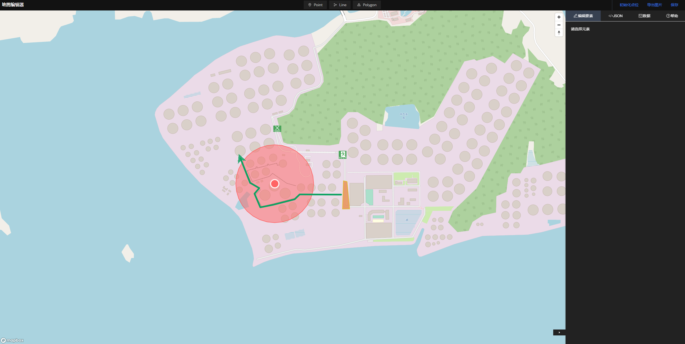

# mapbox-draw-demo

# Docker Cli

```
docker run --name aoshan-map -it -v /home/dell/aoshan-map/dist:/usr/share/nginx/html -v /home/dell/aoshan-map/nginx/conf.d/default.conf:/etc/nginx/conf.d/default.conf -v /home/dell/aoshan-map/nginx/nginx.conf:/etc/nginx/nginx.conf -p 7070:80 --restart always -d nginx
```

## Demo Picture



## Reference

https://fanyi.youdao.com/

https://github.com/iamanvesh/mapbox-gl-draw-circle/blob/master/lib/modes/DirectModeOverride.js

https://github.com/search?p=4&q=mapbox+draw&type=Repositories

https://github.com/amaurym/react-mapbox-gl-draw

https://github.com/mapbox/mapbox-gl-draw/blob/main/docs/MODES.md#available-custom-modes

https://github.com/ReyhaneMasumi/mapbox-gl-draw-split-polygon-mode

https://github.com/mapbox/mapbox-gl-draw/blob/main/docs/API.md

https://docs.mapbox.com/mapbox-gl-js/api/map/#map#removeimage

https://github.com/mapbox/mapbox-gl-draw/blob/main/docs/API.md#styling-draw

https://github.com/mapbox/mapbox-gl-draw/blob/main/docs/EXAMPLES.md

https://turfjs.fenxianglu.cn/category/joins/pointsWithinPolygon.html
